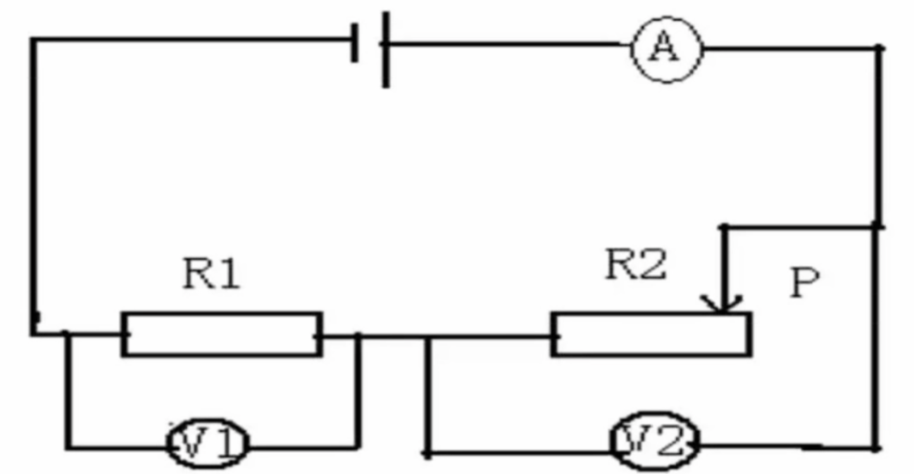
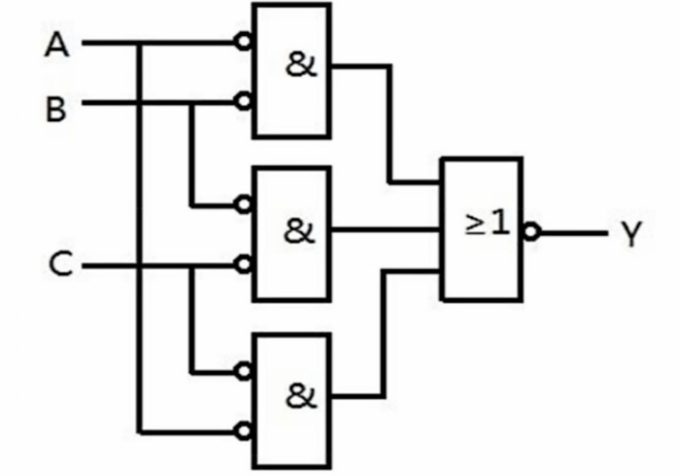
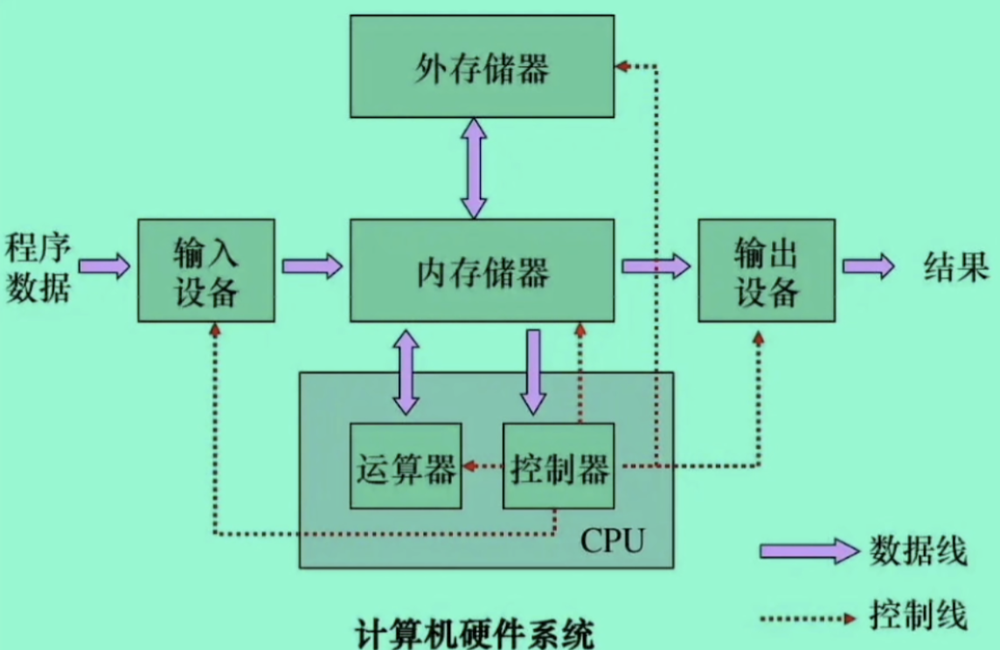

# 计算机思维导论

计算机自1946年问世以来，几乎改变了整个世界：人工智能、电子竞技、大数据。

## 计算机的世界

### 电路与逻辑运算

计算机虽然名字听着很高级，不过它也是由一个个简单电路组成的。

不过，上图所示的电路图太过于简单，只能完成一些很基础的操作，比如点亮小灯泡。想要实现计算机这么高级的运算机器，需要引入更加强大的数字电路。

- 数字电路：
  - 或数字系统，指用数字信号完成对数字量进行<u>算术运算</u>和<u>逻辑运算</u>的电路。
  - 由于它具有逻辑运算和逻辑处理功能，所以又称<u>数字逻辑电路</u>。
  - 现代的数字电路由半导体工艺制成的若干数字集成器件构造而成。
  - 逻辑门是数字逻辑电路的<u>基本单元</u>。
- 《数字电路》课程会对计算机底层的数字电路实现原理进行详细介绍。

数字电路引入了逻辑判断，下图为简单的数字电路：

数字电路中，用电压的高低来区分出两种信号，低电压表示0，高电压表示1，由于只能通过这种方式表示出两种类型的信号，所以计算机采用的是二进制。

- <u>二进制</u>：
  - 是计算技术中广泛采用的一种<u>数制</u>。
  - 二进制数据是用0和1两个数码来表示的数。它的[基数](https://baike.baidu.com/item/基数/4260)为2，进位规则是“逢二进一”，借位规则是“借一当二”。
  - 一般采用的都是十进制表示，如9再继续加1，就需要进位，变成10，在二进制中，因为只有0和1，所以当1继续加1时，就需要进位，变成10（注意，这不是十，读成一零就行了，表示“2”）。

当然，仅仅有两种信号还不够，还需要逻辑门来辅助我们完成更多的计算，最基本的逻辑关系是与、或、非，而逻辑门就有相应的是<u>与门</u>、<u>或门</u>和<u>非门</u>，可以用电阻、电容、二极管、三极管等分立原件构成。

比如与操作，因为只有两种类型，一般将1表示为真，0表示为假，与操作（用&表示）要求两个数参与进来，比如：

- 1 & 1 = 1 必须两边都是真，结果才为真。
- 1 & 0 = 0 两边任意一个或者都不是真，结果为假。

或运算（用 | 表示）：

- 1 | 0 = 1 两边只要有一个为真，结果就为真
- 0 | 0 = 0 两边同时为假，结果才是假

非运算实际上就是取反操作（可以是 ! 表示）

- !1 = 0
- !0 = 1 非运算会将真变成假，假变成真

有了这些运算之后，电路不仅仅可以实现计算，也可以实现各种各样的逻辑判断，最终才能发展成计算机。

### 计算机的基本组成

 

计算机最核心的部件为CPU，因为几乎所有的运算都是依靠CPU进行（各种各样的计算电路已经在CPU中安排好了，只需要发送对应的指令就可以进行对应的运算）

计算机还需要内存来保存运行时的一些数据，以及外存来保存文件（比如硬盘）等。内存的速度远高于外存的速度，所以1G内存的价格远超1G硬盘的价格。

即，计算机包括五大部件：运算器、控制器、存储器、输入和输出设备。有了这一套完整的硬件环境，计算机才算是有了一个完整的身体。
