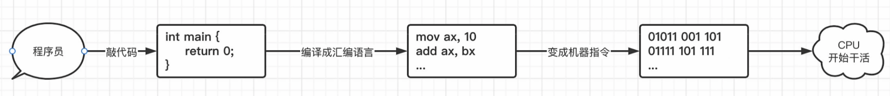

 # 计算机编程语言

计算机的运作原理，实际上是一套完整的硬件+一个成形的操作系统共同存在的。

接着就可以开始了解一下计算机的编程语言了。操作系统也是由编程语言写出来的，操作系统本身也算是一个软件。

那么操作系统是如何让底层硬件进行工作的呢？实际上就是通过向CPU发送指令来完成的。设计的时候就会使CPU支持某些运算，需要使用到这些运算时，只需向CPU发送相应的指令即可。

计算机指令就是指挥机器工作的指示和命令，程序就是一系列按一定顺序排列的指令，执行程序的过程就是计算机的工作过程。CPU运行程序时实际上是按程序从上往下一行一行执行的。

指令集，就是CPU中用来计算和控制计算机系统的一套指令的集合，而每一种新型的CPU在设计时就规定了一系列与其他硬件电路相配合的指令系统。而指令集的先进与否，也关系到CPU的性能发挥，它也是CPU性能体现的一个重要标志。

计算机中的CPU有多种多样的，不同的CPU之间可能也会存在不同的架构，比如现在最常用的是x86架构，还有手机平板这样的移动设备使用的arm架构，不同的架构指令集也会有不同。

计算机底层硬件都是采用的0和1这样的二进制表示，所以指令也是一样的，比如（这里随便写的）：

- 000001 - 代表开机
- 000010 - 代表关机
- 000011 - 代表进行加法运算

当通过电路发送给CPU这样的二进制指令，CPU就能够根据指令执行对应的任务，而编写的程序保存在硬盘中也是这样的二进制形式，用户只需要将这些指令组织好，使计算机能够按照用户的思路一条一条执行对应的命令，就能够让计算机计算任何需要的内容了，这其实就是**机器语言**。

不过随着时代的进步，指令集越来越大，CPU支持的运算类型也越来越多，这样的纯二进制编写实在是太累了，并且越来越多的命令根本记不住，于是就有了**汇编语言**。汇编语言将这些二进制的操作码通过助记符来替换：

- MOV 传送字或字节。
- MOVSX 先符号扩展,再传送。
- MOVZX 先零扩展,再传送。
- PUSH 把字压入堆栈。

把这些原有的二进制命令通过一个单词来代替，就好记多了，在程序编写完成后，我们只需要最后将这些单词转换回二进制指令就可以了，这也是早期出现的**低级编程语言**。

不过虽然通过这些助记符就能够很轻松地记住命令，但是还是不够方便，因为程序可能需要完成一个很庞大的任务，但是如果还是这样一条一条指令进行编写，就太慢了点，有时候可能做一个简单的计算，都需要好几条指令来完成。于是，**高级编程语言**——C语言，终于诞生了。

- C语言诞生于美国的[贝尔实验室](https://baike.baidu.com/item/贝尔实验室/686816)，由[丹尼斯·里奇](https://baike.baidu.com/item/丹尼斯·里奇/7267171)（Dennis MacAlistair Ritchie）以肯尼斯·蓝·汤普森（Kenneth Lane Thompson）设计的[B语言](https://baike.baidu.com/item/B语言/1845842)为基础发展而来，在它的主体设计完成后，汤普森和里奇用它完全重写了UNIX操作系统，且随着UNIX操作系统的发展，C语言也得到了不断的完善。

高级语言不同于低级语言，低级语言的主要操作对象是指令本身，而高级语言却更加符合人脑的认知，更像是通过人的思维去告诉计算机需要做什么，包括语法也会更加的简单易懂。

下面是一段简单的C语言代码：

```c
int main() {
  	int a = 10;   //定义一个a等于10
  	int b = 10;   //定义一个b等于10
  	int c = a + b;   //语义非常明确，c就是a加上b计算出来的结果。
  	return 0;
}
```

C语言虽然支持按照更容易理解的方式去进行编程，但是最后还是会编译成汇编指令，最后变成计算机可以直接执行的指令，不过具体的编译过程，就不需要再关心了，只需要去写就可以了，而对代码进行编译的东西，称为编译器。



当然，除了C语言之外，还有很多其他的高级语言，比如Java、Python、C#、PHP等等，相比其他编程语言，C算是比较古老的一种了，但是时隔多年直至今日，其他编程语言也依然无法撼动它的王者地位：


很多操作系统、高级编程语言底层实现，几乎都是依靠C语言去编写的（包括Java的底层也是C/C++实现的）.


