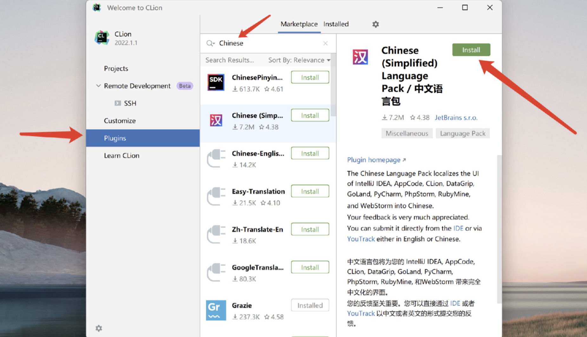
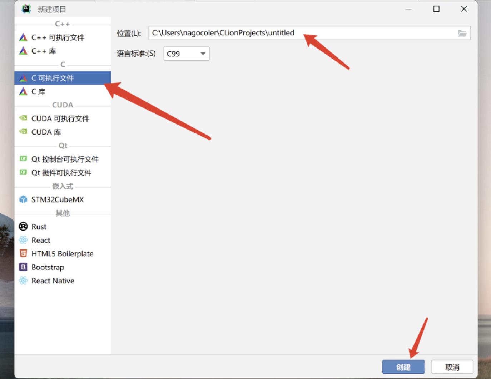
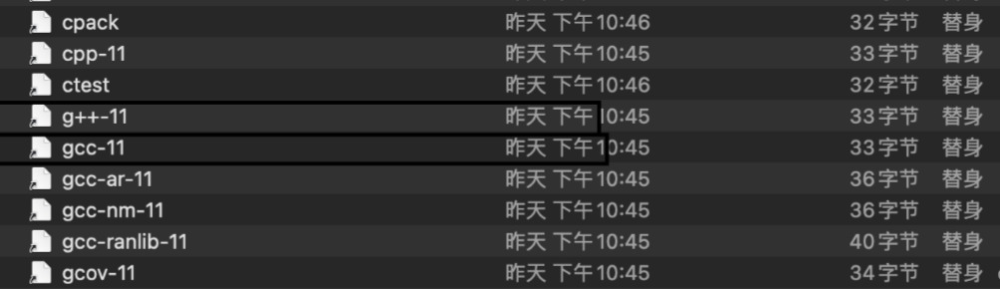
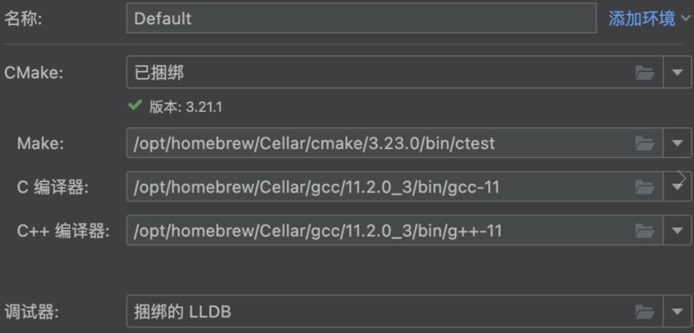

# C语言开发环境部署

完成开发环境部署之后，就可以使用C语言来将一句话输出到控制台了，成功编译运行下面的简单程序：

```c
#include <stdio.h>

int main() {
    printf("HelloWorld\n");
    return 0;
}
```

首先，既然要将编写的C语言代码进行编译，那么肯定得找到一个合适的编译器才行，现代的集成开发环境IDE一般都包含了这些编译器，所以不需要进行单独的安装。只需要找一个集成开发环境去安装就行了，目前功能比较完善的集成开发环境有：

- Codeblocks（支持Windows、Linux、MacOS操作系统）
- Visual Studio（支持Windows、MacOS操作系统）
- CLion（支持Windows、Linux、MacOS操作系统）

由于是英文，使用不太方便，所以我们安装一下中文插件：



现在创建第一个C语言项目:



选择C可执行文件，然后项目的保存位置可以自行修改，配置完成后点击创建

## 博文：Clion for Mac(M1)配置环境

https://blog.csdn.net/qq_43075377/article/details/124029724

### 一、安装Homebrew
首选安装国内节点的Homebrew
`/bin/zsh -c "$(curl -fsSL https://gitee.com/cunkai/HomebrewCN/raw/master/Homebrew.sh)`
选择中科大节点下载。

安装好homebrew后，在终端输入以下命令：
`brew install gcc`

若显安装包错，且第一句提醒需要安装Command Line Tools，则输入：
`xcode-select --install`

### 二、安装gcc以及cmake
安装完gcc后重新输入
`brew install gcc`
继续输入：
`brew install cmake`

### 三、配置环境

首先是确定gcc、g++以及cmake的位置：
`whereis gcc`
`whereis make`

确定了位置，便去访达中找到这俩个的位置。打开自己的Macinosh磁盘（总磁盘），按“shift”、“command”“.”（三键同按）显示隐藏的文件夹，就可以找到了，记住位置。

以该博文为例，在opt/homebrew/bin里，打开后，可以看见如下图很多文件，其中cpp-11中的11就是版本号，这里也需要记住



之后打开CLion，点击 `new project`，在`Language standard`中选择对应版本好的数字，比如是11.2，就选择C++11。

接着点击左上角的CLion，点击`preference`，搜索`Toolchains`。



如果上述过程所显示的文件夹一致，则可以按照填写，如果不一致，双击路径后面的文件夹，在弹出来的访达框中重新去找刚才所显示的文件（重新查找的文件夹默认也是隐藏的，需要按“shift”、“command”、“.”（三键同按））。

Clion中Make路径对应的ctest文件、C编译器对应的gcc-11文件、C++编译器对应的g++-11文件。

到此为止，大功告成。

遇到的问题：CMake生成器选择 “让CMake决定”