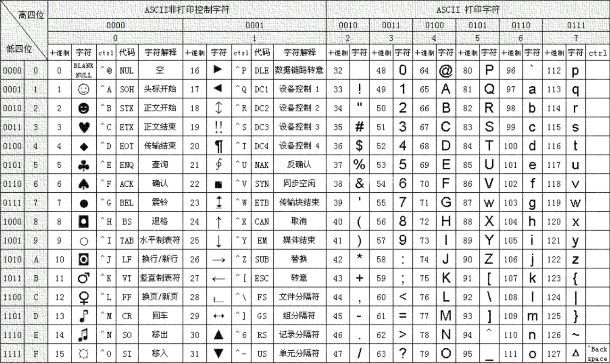
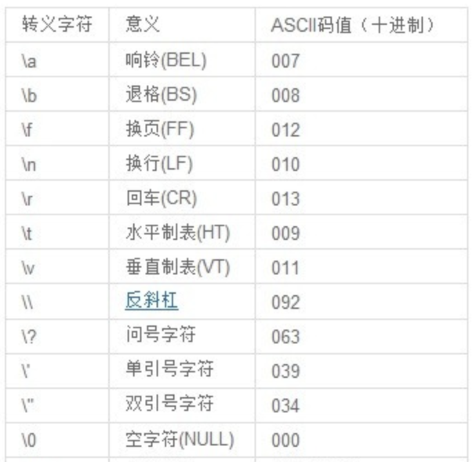

### 整数类型

首先来看整数类型，整数就是不包含小数点的数据，比如`1`，`99`，`666`等数字，整数包含以下几种类型：

- int - 占用 4 个字节，32个bit位，能够表示 -2,147,483,648 到 2,147,483,647 （21亿）之间的数字，默认一般都是使用这种类型
- long - 占用 8 个字节，64个bit位。
- short - 占用2个字节，16个bit位。

### 浮点类型

浮点类型一般用于保存小数，一个小数分为整数部分和小数部分，需要用一部分的bit位去表示整数部分，而另一部分去表示小数部分，至于整数部分和小数部分各自占多少并不是固定的，而是浮动决定的。

- float - 单精度浮点，占用4个字节，32个bit位。
- double - 双精度浮点，占用8个字节，64个bit位。

### 字符类型

除了保存数字之外，C语言还支持字符类型，每一个字符都可以使用字符类型来保存：

- char - 占用1个字节（-128~127），可以表示所有的ASCII码字符，每一个数字对应的是编码表中的一个字符：

编码表中包含了所有常见的字符，包括运算符号、数字、大小写字母等（注意只有英文相关的，没有中文和其他语言字符，包括中文的标点符号）

某些无法直接显示的字符（比如换行，换行，也算一个字符）需要使用转义字符来进行表示：

