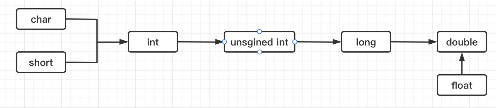

### 类型转换

一种类型的数据可以转换为其他类型的数据，这种操作称为类型转换，类型转换分为**自动类型转换**和**强制类型转换**（也称为隐式类型转换和显式类型转换），如现在希望将一个short类型的数据转换为int类型的数据：

```c
#include <stdio.h>

int main() {
    short s = 10;
    int i = s;   //直接将s的值传递给i即可，但是注意此时s和i的类型不同
}
```

这里就是一种自动类型转换，自动类型转换就是编译器隐式地进行的数据类型转换。不用截断的就是隐式、自动。

```c
float a = 3;    //一个int整数3但是却可以赋值给float类型，说明也是进行了自动类型转换
```

如果使用一个比转换的类型最大值都还要大的值进行类型转换，比如：

```c
#include <stdio.h>

int main() {
    int a = 511;
    char b = a;   //最大127
    printf("%d", b);
}
```

**结果为 -1**

很明显char类型是无法容纳大于127的数据的，因为只占一个字节，而int占4个字节，如果需要进行转换，那么就只能丢掉前面的，只保留char所需要的那几位了，所以这里得到的就是 -1：

- 511 = int -> 00000000 00000000 00000001 11111111
- char -> 11111111 -> -1

也可以将整数和小数类型的数据进行互相转换：

```c
#include <stdio.h>

int main() {
    int a = 99;
    double d = a;
    printf("%f", d);
}
```

**结果为 99.000000**

不过这里需要注意的是，小数类型在转换回整数类型时，会丢失小数部分（不是四舍五入）：

```c
#include <stdio.h>

int main() {
    double a = 3.14;
    int b = a;    //这里编译器提示了黄标，可以通过之后讲到的强制类型转换来处理
    printf("%d", b);
}
```

**结果为 3**

除了赋值操作可以进行自动类型转换之外，在运算中也会进行自动类型转换，比如：

```c
#include <stdio.h>

int main() {
    float a = 2;
    int b = 3;
    double c = b / a;   //  "/" 是除以的意思，也就是数学中的除法运算，这里表示b除以a
    printf("%f", c);
}
```

**结果为1.500000**

可以看到，这里得到的结果是小数1.5，但是参与运算的既有整数类型，又有浮点类型，为什么结果就确定为浮点类型了呢？这显然是由于类型转换导致的。规则如下：



- 不同的类型优先级不同（根据长度而定）
- char和short类型在参与运算时一律转换为int再进行运算。
- 浮点类型默认按双精度进行计算，所以就算有float类型，也会转换为double类型参与计算。
- 当有一个更高优先级的类型和一个低优先级的类型同时参与运算时，统一转换为高优先级运算，比如int和long参与运算，那么int转换为long再算，所以结果也是long类型，int和double参与运算，那么先把int转换为double再算。

接着来看看强制类型转换，可以为手动去指定类型，强制类型转换格式如下：

```c
(强制转换类型) 变量、常量或表达式;
```

比如：

```c
#include <stdio.h>

int main() {
    int a = (int) 2.5;   //2.5是一个double类型的值，但是可以强制转换为int类型赋值给a，强制转换之后小数部分丢失
    printf("%d", a);
}
```

也可以对一个算式的结果进行类型转换：

```c
#include <stdio.h>

int main() {
    double a = 3.14;
    int b = (int) (a + 2.8);   //注意,括起来表示对整个算式的结果进行类型转换（括号跟数学中的挺像，也是提升优先级使用的），不然强制类型转换只对其之后紧跟着的变量生效
    printf("%d", b);
}
```

在需要得到两个int相除之后带小数的结果时，强制类型转换就显得很有用：

```java
#include <stdio.h>

int main() {
    int a = 10, b = 4;
    double c = a / b;    //不进行任何的类型转换，int除以int结果仍然是int，导致小数丢失
    double d = (double) a / b;   //对a进行强制类型转换，现在是double和int计算，根据上面自动类型转换规则，后面的int自动转换为double，结果也是double了，这样就是正确的结果了
    printf("不进行类型转换: %f, 进行类型转换: %f", c, d);
}
```

合理地使用强制类型转换，能够解决我们很多情况下的计算问题。