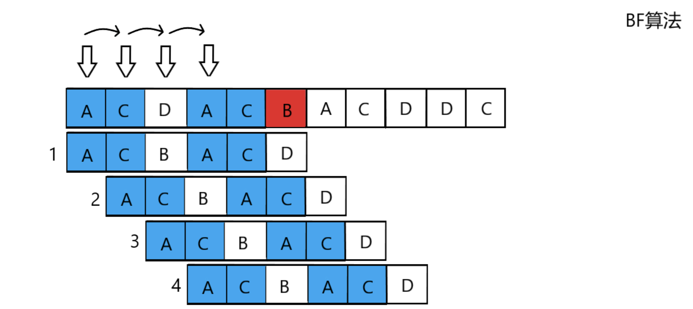
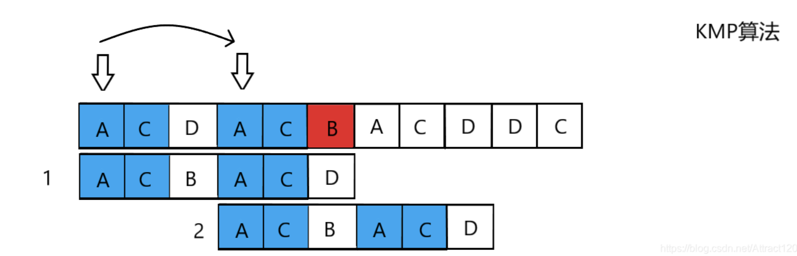
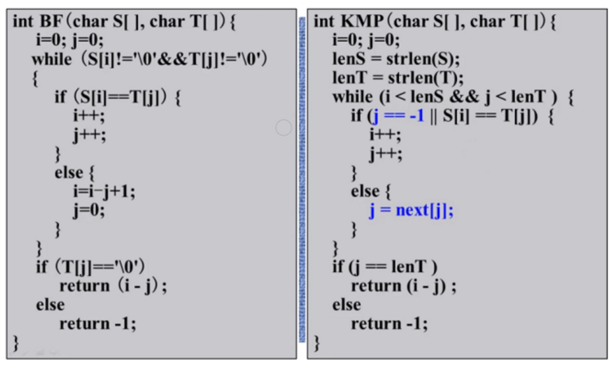
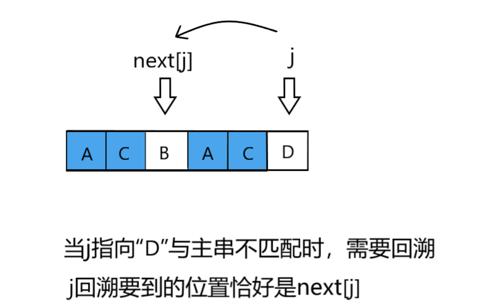
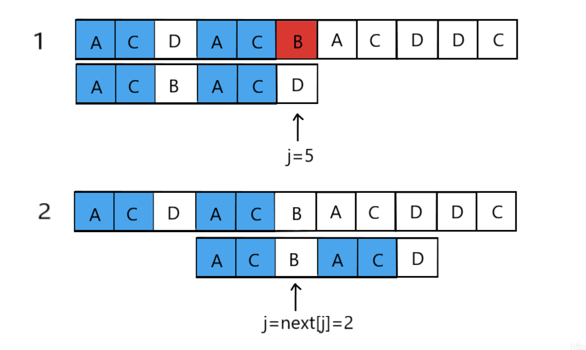

现在有两个字符串：

> str1 = "abcdabbc"
>
> str2 = "cda"

现在请你设计一个C语言程序，判断第一个字符串中是否包含了第二个字符串，比如上面的例子中，很明显第一个字符串包含了第二个字符串。

在拿到子串时，需要根据子串来计算一个`next`数组，其与子串长度相同，它存储了不匹配发生在对应的位置上时，应该在哪一个位置开始继续比较。

求法：

- 从第一位开始依次推导
- next数组的第一位一定是0
- 从第二位开始（用`i`表示），将第`i-1`个字符（也就是前一个）与其对应的`next[i-1]-1`位上的字符进行比较
- 如果相等，那么`next[i]`位置的值就是`next[i-1]-1`
- 如果不相等，则继续向前计算一次`next[next[i-1]-1]`位置上的字符和第`i-1`个字符是否相同，直到找到相等的为止。并且这个位置对应的值加上1就是`next[i]`的值了，要是都已经到头了都没有相等的，那么`next[i]=1`

## 什么是KMP算法？
KMP算法是一种改进的字符串匹配算法，由D.E.Knuth，J.H.Morris和V.R.Pratt提出的，简称KMP算法。

KMP算法的核心是利用匹配失败后的信息，尽量减少模式串与主串的匹配次数以达到快速匹配的目的。

具体实现就是通过一个`next()`函数实现，函数本身包含了模式串的局部匹配信息。

## KMP算法与BF（暴力破解法）的区别
KMP算法是建立在BF算法基础上的，KMP算法与BF算法的最大区别在于，BF算法只能一位一位匹配，而KMP算法能够省去不必要的匹配步骤，从而实现跳位的匹配：





- 主串S“ACDACBACDDC”，模式串T“ACBACD”
  - 匹配相比之下，BF算法匹配成功需匹配4次，而KMP算法只需匹配2次就可以
  - 为什么KMP算法的步子可以跨这么大？是因为KMP算法中的next数组存放了模式串T出现重复字符的信息，利用已经部分匹配这个有效信息，保持i指针不回溯，通过修改j指针，让模式串尽量地移动到有效的位置，而避免模式串移动到无效位置（BF算法中2-3步均为无效位置）。



- 通过算法比较发现KMP算法与BF算法结构类似，最大的区别在于else里的`j=next[j]`；也就是 i 不回溯，j 回溯到 next[ j ] 的位置，而不是每次都从零开始。

## next是啥？
next顾名思义，是下一个的意思，那么其作用是在回溯时指引指针j回溯的下一位置，也就是`j=next[j]`；`next[j]`也就是j下一个要回溯到的位置。



举个例子：主串S“ACDACBACDDC”，模式串T“ACBACD”

- 当前j=5时，此时j位next[j]=next[5]=2，也就是说“D”前面（"D"的左边）最大匹配长度为2，观察模式串“ACBAC”也不难发现j指向的“D”的前面的“AC”（后缀）与模式串最前端的“AC”一致，此时让j回溯，观察发现，“D”前面的AC先与主串匹配成功了，只需要将前缀的“AC”平移过来对齐就可以了。



实现：

```c
#include <stdio.h>
#include <string.h>
void get_next(char s[],int next[]);
int KMP(char s1[],char s2[],int next[]);
int main() {
	int i= 0;
	int next[1000];
	char s2[] = "abcac";
	char s1[] = "ababcabcacbab";
	get_next(s2,next);
    
	i=KMP(s1,s2,next);
    printf("%d\n",i);
    return 0;
}
void get_next(char s[],int next[])
{	
	int len=0;
    int i=0;
    int j=-1;
    next[0]=-1;
    len=strlen(s);
    while(i<len-1)
    {
        if(j==-1||s[i]==s[j])
        {
            i++;
            j++;
						next[i]=j;
        }
        else
        {
            j=next[j];
        }
    }
}
int KMP(char s1[],char s2[],int next[])
{
    int i=0;
    int j=0;
    int len1=strlen(s1);
    int len2=strlen(s2);
    while(i<len1&&j<len2)
    {
        if(j==-1||s1[i]==s2[j])
        {
            i++;
            j++;
        }
        else
        {
            j=next[j];
        }
    }
    if(j>=len2)
        return i-len2+1;
    else
        return -1;
}


```


