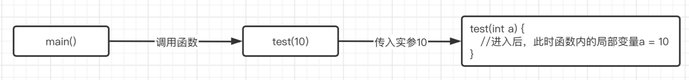

### 函数参数和返回

函数可以接收参数来完成任务，比如现在想要实现**用一个函数计算两个数的和并输出到控制台。**

这种情况需要将进行加法计算的两个数，告诉函数，这样函数才能对这两个数求和，可以通过设定参数：

```c
#include <stdio.h>

void sum(int, int);   //函数原型中需要写上需要的参数类型，多个参数用逗号隔开，比如这里需要的就是两个int类型的参数

int main() {

}

void sum(int a, int b){  //函数具体定义中也要写上，这里的a和b称为形式参数（形参），等价于函数中的局部变量，作用域仅限此函数
		printf("%d", a + b);
}
```

那么现在定义完成了，使用这个函数：

```c
int main() {
    sum(10, 20);   //这里直接填写一个常量、变量或是运算表达式都是可以的，称实际传入的值为实际参数（实参）
}
```

**结果：30**

实际上传入的实参在进入到函数时，会自动给函数中形参（局部变量）进行赋值，这样在函数中就可以得到外部传入的参数值了。



`printf`函数：

```c
int  printf(const char * __restrict, ...) __printflike(1, 2);   //看起来比较高级
```

这里主要关心它的两个参数，一个是`char *`由于还没有学习指针，这里就把它当做`const char[]`就行了，表示一个不可修改的字符串，而第二个参数是`...`

如果想要填写具体需要打印的值时，可以一直往后写：

```c
printf("%d, %d", 1, 2);   //参数可以一直写
```

正常情况下，函数的参数列表都是固定的，怎么才能写很多个呢？这就要用到可变长参数了。`...`为可变长参数。

如果修改形式参数的值，外面的实参值会跟着发生修改吗：

```c
#include <stdio.h>

void swap(int, int);

int main() {
    int a = 10, b = 20;
    swap(a, b);

    printf("a = %d, b = %d", a, b);   //最后会得到什么结果？
}

void swap(int a, int b){
    int tmp = a;   //这里对a和b的值进行交换
    a = b;
    b = tmp;
}
```

**结果：a = 10, b = 20**

函数的形参实际上就是函数内的局部变量，它的作用域仅仅是这个函数，而外面传入的实参，仅仅只是将值赋值给了函数内的形参而已，并且外部的变量跟函数内部的变量作用域都不同，所以没有关系，这里交换的仅仅是函数内部的两个形参变量值，跟外部作实参的变量没有任何关系。

实现通过函数交换两个变量的值呢会在指针部分进行讨论。

不过数组却不受限制，在函数中修改数组的值，是直接可以生效的：

```c
#include <stdio.h>

void test(int arr[]);

int main() {
    int arr[] = {4, 3, 8, 2, 1, 7, 5, 6, 9, 0};
    test(arr);
    printf("%d", arr[0]);  //打印的是修改后的值了
}

void test(int arr[]) {
    arr[0] = 999;   //数组就可以做到里面修改，外面生效
}
```

再来看一个例子：

```c
#include <stdio.h>

void test(int a){
    a += 10;
    printf("%d\n", a);
}

int main() {
    int a = 10;
    test(a);
    test(a);   //连续两次调用，那么这两次的结果会是什么？
}
```

结果都是20，每次调用函数都是单独进行的，并不是复用函数中的形参，实际上这两次调用都是单独进行的，形参a都是在一开始的时候被赋值为实参的值的，这两次调用没有任何关系，并且函数执行完毕后就自动销毁了。

如果希望每次调用函数时保留变量的值，可以使用静态变量：

```c
#include <stdio.h>

void test();

int main() {
    test();
    test();
}

void test() {
    static int a = 20;   //静态变量并不会在函数结束时销毁其值，而是保持
    a += 20;
    printf("%d ", a);
}
```

接着来看函数的返回值，并不是所有的函数都是执行完毕就结束了的，可能某些时候需要函数告知执行的结果如何，这时就需要用到返回值了，比如现在希望实现一个函数计算a+b的值：

```c
#include <stdio.h>

int sum(int ,int );   //现在要返回a和b的和（int类型）所以这里需要将返回值类型修改为int

int main() {
    int a = 10, b = 20;   //计算a和b的和
  	int result = sum(a, b);   //函数执行后，会返回一个int类型的结果，可以接收它，也可以像下面一样直接打印，当然也可以参与运算等等。
    printf("a+b=%d", sum(a, b));
}

int sum(int a, int b) {
    return a + b;   //通过return关键字来返回计算的结果
}
```

接着来看下一个例子，现在希望通过函数找到数组中第一个小于0的数字并将其返回，如果没有找到任何小于0的数，就返回0即可：

```c
#include <stdio.h>

int findMin(int arr[], int len);   //需要两个参数，一个是数组本身，还有一个是数组的长度

int main() {
    int arr[] = {1, 4, -9, 2, -4, 7};
    int min = findMin(arr, 6);
    printf("第一个小于0的数是：%d", min);
}

int findMin(int arr[], int len) {
    for (int i = 0; i < len; ++i) {
        if(arr[i] < 0) return arr[i];   //当判断找到后，直接return返回即可，这样的话函数会直接返回结果，无论后面还有没有代码没有执行完，整个函数都会直接结束。
    }
    return 0;   //如果没有找到就返回0
}
```

这里使用了`return`关键字来返回结果，注意当程序走到`return`时，无论还有什么内容没执行完，整个函数都将结束，并返回结果。

注意带返回值（非void）的函数中的所有情况都需要有一个对应的返回值：

```c
int test(int a) {
    if (a > 0) {
        return 10;   //当a大于0时有返回语句
    } else{
          //但是当a不大于0时就没有返回值了，这样虽然可以编译通过，但是会有警告（黄标），运行后可能会出现一些无法预知的问题
    }
}
```

如果是没有返回值的函数，也可以调用`return`来返回，不过默认情况下是可以省略的，需要停止时可以加上：

```c
void test(int a){
    if(a == 10) return;   //因为是void，所以什么都不需要加，直接return
    printf("%d", a);
}
```