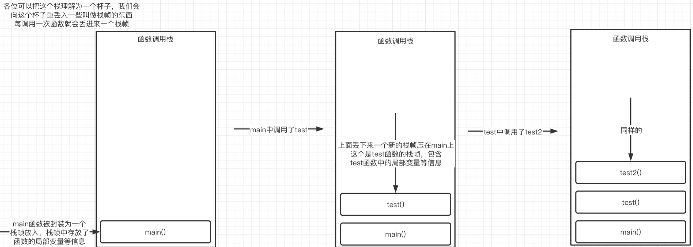
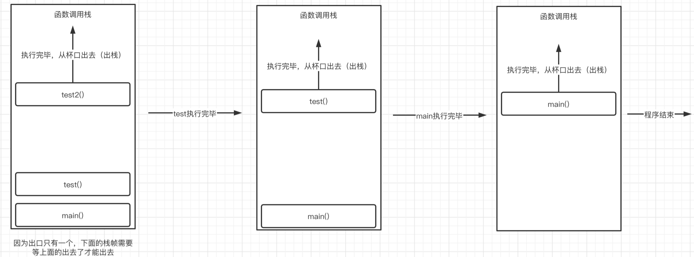
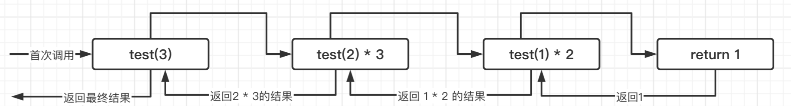

### 递归调用

函数除了在其他地方被调用之外，也可以自己调用自己（套娃），称为递归。

```c
#include <stdio.h>

void test(){
    printf("Hello World!\n");
    test();   //函数自己在调用自己，这样的话下一轮又会进入到这个函数中
}

int main() {
    test();
}
```

可以尝试运行一下上面的程序，会发现程序直接无限打印`Hello World!`这个字符串，这是因为函数自己在调用自己，不断地重复进入到这个函数，理论情况下，它将永远都不会结束，而是无限地执行这个函数的内容。

但是到最后程序还是终止了，这是因为函数调用有最大的深度限制，因为计算机不可能放任函数无限地进行下去。

> **大致了解一下函数的调用过程，实际上在程序运行时会有一个叫做函数调用栈**的东西，它用于控制函数的调用：
>
> ```c
> #include <stdio.h>   //以下面的调用关系为例
> 
> void test2(){
>     printf("giao");
> }
> 
> void test(){
>     test2();   //main -> test -> test2
>   	printf("giao");
> }
> 
> int main() {
>     test();
>   	printf("giao");
> }
> ```
>
> 其实可以很轻易地看出整个调用关系，首先是从main函数进入，然后调用test函数，在test函数中又调用了test2函数，此时需要等待test2函数执行完毕，test才能继续，而main则需要等待test执行完毕才能继续。而实际上这个过程是由函数调用栈在控制的：
>
> 
>
> 而当test2函数执行完毕后，每个栈帧又依次从栈中出去：
>
> 
>
> 当所有的栈全部出去之后，程序结束。
>
> 所以这也就不难解释为什么无限递归会导致程序出现错误，因为栈的空间有限，而函数又一直在进行自我调用，所以会导致不断地有新的栈帧进入，最后塞满整个栈的空间，就爆炸了，这种问题称为栈溢出（Stack Overflow）

当然，如果按照规范使用递归操作，是非常方便的，比如现在需要求某个数的阶乘：

```c
#include <stdio.h>

int test(int n);

int main() {
    printf("%d", test(3));
}

int test(int n){
    if(n == 1) return 1;   //因为不能无限制递归下去，所以这里添加一个结束条件，在n = 1时返回
    return test(n - 1) * n;  //每次都让n乘以其下一级的计算结果，下一级就是n-1了
}
```

通过给递归调用适当地添加结束条件，这样就不会无限循环了，并且程序看起来无比简洁



它看起来就像是一个先走到底部，然后拿到问题的钥匙后逐步返回的一个过程，并在返回的途中不断进行计算最后得到结果。

所以，合理地使用递归反而是一件很有意思的事情。