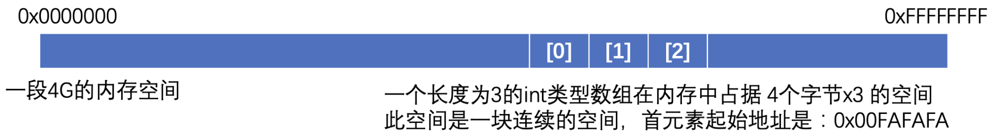
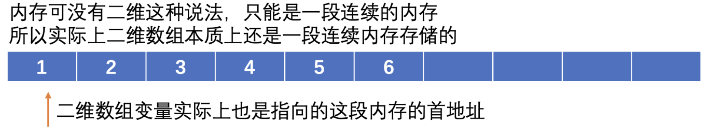

### 指针与数组

前面介绍了指针的基本使用，来回顾一个问题，为什么数组可以以原身在函数之间进行传递呢？

先说结论，数组表示法实际上是在变相地使用指针，你甚至可以将其理解为数组变量其实就是一个指针变量，它存放的就是数组中第一个元素的起始地址。

```c
#include <stdio.h>

int main(){
    char str[] = "Hello World!";
    char * p = str;   //可以直接把数组作为地址赋值给指针变量p

    printf("%c", *p);   //正常使用，打印出第一个字符
}
```

**结果：H**

```c
int main(){
    char str[] = "Hello World!";
    char * p = str;

    printf("%c", p[1]);   //能够像在使用数组一样用指针
}
```

**结果：e**

数组在内存中是如何存放的：



数组在内存中是一块连续的空间，声明数组一定要明确类型和大小是因为这一块连续的内存空间生成后就固定了。

而数组变量实际上存放的就是首元素的地址，而实际上之前一直使用的都是**数组表示法**来操作数组，这样可以很方便地对内存中的各个元素值进行操作：

```c
int main(){
    char str[] = "Hello World!";
    printf("%c", str[0]);   //直接在中括号中输入对应的下标就能访问对应位置上的数组了
}
```

而实际上`str`表示的就是数组的首地址，所以完全可以将其赋值给一个指针变量，因为指针变量也是存放的地址：

```c
char str[] = "Hello World!";
char * p = str;   //直接把str代表的首元素地址给到p
```

而使用指针后，实际上可以使用另一种表示法来操作数组，这种表示法叫做**指针表示法**：

```c
int main(){
    char str[] = "Hello World!";
    char * p = str;

    printf("第一个元素值为：%c，第二个元素值为：%c", *p, *(p+1));   //通过指针也可以表示对应位置上的值
}
```

比如现在需要表示数组中的第二个元素：

- 数组表示法：`str[1]`
- 指针表示法：`*(p+1)`

虽然写法不同，但是他们表示的意义是完全相同的，都代表了数组中的第二个元素，其中指针表示法使用了`p+1`的形式表示第二个元素，这里的`+1`操作并不是让地址+1，而是让地址`+ 一倍的对应类型大小`，也就是说地址后移一个char的长度，所以正好指向了第二个元素，然后通过`*`取到对应的值（注意这种操作仅对数组是有意义的，如果是普通的变量，虽然也可以通过这种方式获得后一个char的长度的数据，但是毫无意义）

```c
*(p+i)   <=>    str[i]    //实际上就是可以相互转换的
```

这两种表示法都可以对内存中存放的数组内容进行操作，只是写法不同罢了，所以数组和指针混用也就不奇怪了。

了解了这些东西之后，来看看下面的各个表达式分别代表什么：

```c
*p   //数组的第一个元素
p   //数组的第一个元素的地址
p == str   //肯定是真，因为都是数组首元素地址
*str    //因为str就是首元素的地址，所以这里对地址加*就代表第一个元素，使用的是指针表示法
&str[0]   //这里得到的实际上还是首元素的地址
*(p + 1)   //代表第二个元素
p + 1    //第二个元素的内存地址
*p + 1    //注意*的优先级比+要高，所以这里代表的是首元素的值+1
```

所以不难理解，为什么`printf`函数的参数是一个`const char *`了，实际上就是需要传入一个字符串而已，只不过这里采用的是指针表示法而已。

当然指针也可以进行自增和自减操作，但是数组表示法不可以，比如：

```c
#include <stdio.h>

int main(){
    char str[] = "Hello World!";
    char * p = str;

    p++;  //自增后相当于指针指向了第二个元素的地址

    printf("%c", *p);   //所以这里打印的就是第二个元素的值了
}
```

一维数组看完了，来看看二维数组，那么二维数组在内存中是如何表示的呢？

```c
int arr[2][3] = {{1, 2, 3}, {4, 5, 6}};
```

这是一个2x3的二维数组，其中存放了两个能够容纳三个元素的数组，在内存中，是这样的：



所以虽然可以使用二维数组的语法来访问这些元素，但其实也可以使用指针来进行访问：

```c
#include <stdio.h>

int main(){
    int arr[][3] = {{1, 2, 3}, {4, 5, 6}};
    int * p = arr[0];  //因为是二维数组，注意这里要指向第一个元素，来降一个维度才能正确给到指针
  	int * p = arr;	//好像也可以，但是会黄标 
    //同理如果这里是arr[1]的话那么就表示指向二维数组中第二个数组的首元素
    printf("%d = %d", *(p + 4), arr[1][1]);   //实际上这两种访问形式都是一样的
}
```