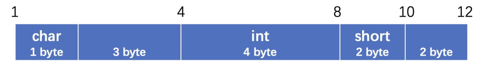

数据类型：包括整数、小数、字符、数组等，通过使用对应的数据类型，可以轻松地将数据进行保存，但是有时候，这种简单的类型很难去表示一些复杂结构。

### 创建和使用结构体

比如现在要保存100个学生的信息，学生信息包括学号、姓名、年龄。

似乎找不到一种数据类型能够同时保存这三种数据（数组虽然能保存一些列的元素，但是只能保存同种类型的）。但是如果把它们拆开，就可以使用对应的类型存放了，但是这些数据应该是捆绑在一起的，而不是单独地去存放。

所以，为了解决这种问题，C语言提供了结构体类型，它能够将多种类型的数据集结到一起，让它们形成一个整体。

```c
struct Student {   //使用 (struct关键字 + 结构体类型名称) 来声明结构体类型，同样也可以作为函数的参数、返回值之类的
    int id;    //结构体中可以包含多个不同类型的数据，这些数据共同组成了整个结构体类型，结构体内部也能包含结构体类型的变量
    int age;
    char * name;   //用户名可以用指针指向一个字符串，也可以用char数组来存，如果是指针的话，那么数据不会存在结构体中，只会存放字符串的地址，但是如果是数组的话，数据会存放在结构体中
};
int main() {
    struct Student {   //也可以以局部形式存在
        
    };
}
```

定义好结构体后，只需要使用结构体名称作为类型就可以创建一个结构体变量了：

```c
#include <stdio.h>

struct Student {
    int id;
    int age;
    char * name;
};

int main() {
  	//类型需要写为struct Student，后面就是变量名称
    struct Student s = {1, 18, "小明"};     //结构体包含多种类型的数据（它们是一个整体），只需要把这些数据依次写好放在花括号里面就行了
}
struct Student {
    int id;
    int age;
    char * name;
} s;  //也可以直接在花括号后面写上变量名称（多个用逗号隔开），声明一个全局变量
```

结构体的初始化需要注意：

```c
struct Student s = {1, 18};   //如果只写一半，那么只会初始化其中一部分数据，剩余的内容相当于没有初始值，跟数组是一样的
struct Student s = {1, .name = "小红"};   //也可以指定去初始化哪一个属性 .变量名称 = 初始值
```

访问结构体内部存储的各种数据呢：

```c
printf("id = %d, age = %d, name = %s", s.id, s.age, s.name);  //结构体变量.数据名称 (这里.也是一种运算符) 就可以访问结构体中存放的对应的数据了
```

也可以通过同样的方式对结构体中的数据进行修改：

```C
int main() {
    struct Student s = {1, 18, "小明"};

    s.name = "小红";
  	s.age = 17;

    printf("id = %d, age = %d, name = %s", s.id, s.age, s.name);
}
```

计算结构体在内存中占据的大小：

```c
struct Object {
    int a;
    short b;
    char c;
};
```

这里我们可以借助`sizeof`关键字来帮助我们计算：

```c
int main() {
    printf("int类型的大小是：%lu", sizeof(int));  //sizeof能够计算数据在内存中所占据的空间大小（字节为单位）
}
```

**结果：4**

当然也可以计算变量的值占据的大小：

```c
int main() {
    int arr[10];
    printf("int arr[10]占据的大小是：%lu", sizeof (arr)); //在判断非类型时，sizeof 括号可省
}
```

**结果：40**

同样的，也能计算结构体类型会占用多少的空间：

```c
#include <stdio.h>

struct Object {
  	char a;
    int b;
    short c;
};

int main() {
    printf("%lu", sizeof(struct Object));   //直接填入struct Object作为类型
}
```

**结果：12**

实际上结构体的大小是遵循下面的规则来进行计算的：

- 结构体中的各个数据要求字节对齐，规则如下：
  - **规则一：**结构体中元素按照定义顺序依次置于内存中，但并不是紧密排列的。从结构体首地址开始依次将元素放入内存，元素会被放置在其自身大小的整数倍地址上（0默认是所有大小的整数倍）
  - **规则二：**如果结构体大小不是所有元素中最大对齐大小的整数倍，则结构体对齐到元素最大对齐大小的整数倍，填充空间放置到结构体末尾。
  - **规则三：**基本数据类型的对齐大小为其自身的大小，结构体数据类型的对齐大小为其元素中最大对齐大小元素的对齐大小。

以下面为例：

```c
struct Object {
  	char a;   //char占据1个字节
    int b;   //int占据4个字节，因为前面存了一个char，按理说应该从第2个字节开始存放，但是根据规则一，必须在自己的整数倍位置上存放，所以2不是4的整数倍位置，这时离1最近的下一个整数倍地址就是4了，所以前面空3个字节的位置出来，然后再放置
    short c; //前面存完int之后，就是从8开始了，刚好满足short（2字节）的整数倍，但是根据规则二，整个结构体大小必须是最大对齐大小的整数倍（这里最大对齐大小是int，所以是4），存完short之后，只有10个字节，所以后面再补两个空字节，这样就可以了
};
```



这样，就可以得出结构体的大小为12