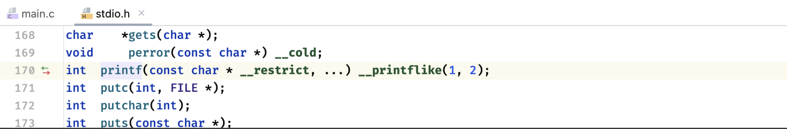

## 预处理

```c
#include <stdio.h>
```

`#include`实际上是一种预处理指令，在程序运行之前，会有一个叫做"C预处理器"的东西，根据程序中的预处理指令，预处理器能把对应的指令替换为指令想要表示的内容。

### 文件包含

当预处理器发现`#include`指令时，会查看后面的文件名，并把文件的内容包含到当前文件中，来替换掉`#include`指令。比如：

```c
int main() {
    printf("Hello World!");   //一个很普通的printf打印函数
}
```

pringtf函数是由系统提供的函数，实际上这个函数是在其他源文件中定义好的，而定义这个函数的源文件，就是`stdio.h`



还有很多很多的函数原型定义，也被写到这个源文件中，而这个文件并不是以`.c`结尾的，而是以`.h`结尾的，这种文件称为**头文件**。头文件一般仅包含定义一类的简单信息，只要能让编译器认识就行了。

而`#include`则是将这些头文件中提供的信息包含到C语言源文件中，这样我们才能使用定义好的`printf`函数

`#include`的具体使用格式如下：

```c
#include <文件名称>
```

当然也可以写成：

```
#include "文件名称"
```

这两种写法虽然都能引入头文件，但是区别还是有的：

- **尖括号：**引用的是编译器的库路径里面的头文件。
- **双引号：**引用的是程序目录中相对路径中的头文件，如果找不到再去上面的库里面找。


可以看到系统已经提供好了多种多样的头文件了，通过这些系统提供的库，就可以做很多的事情。

当然也可以自己编写一个头文件，直接在项目根目录下创建一个新的C/C++头文件：

```c
//
// Created by Nago Coler on 2023/6/26.
//

#ifndef UNTITLED_TEST_H
#define UNTITLED_TEST_H

#endif //UNTITLED_TEST_H
```

可以看到系统自动生成好了这些内容

```c
int test(int a, int b);
```

直接在头文件中随便声明一个函数原型，接着就可以引入这个头文件了：

```c
#include <stdio.h>
#include "test.h"   //因为是自己项目目录中的，所以需要使用双引号

int main() {
    int c = test(1, 2);   //这样就可以使用头文件中声明的函数了
}
```

通过导入头文件，就可以使用定义好的各种内容了，当然，不仅仅局限于函数。

不过现在还没办法执行，因为这里只是引入了头文件中定义的函数原型，具体的函数实现一般还是使用`.c`源代码文件去进行编写，这里创建一个同名的C源文件（不强制要求同名，但是这样看着整齐一点）去实现一下：

```c
#include "test.h"  //这里也需要把定义引入

int test(int a, int b) {   //编写函数具体实现
    return a + b;
}
```

这样，我们再次运行程序就可以正确得到结果了：

**结果：3**

实际上预处理器正是通过头文件得到编译代码时所需的一些信息，然后才能把程序需要的内容（比如这里要用到的test函数）替换到源文件中，最后才能正确编译为可执行程序。

比如现在要做一个学生管理库，这个库中提供了学生结构体的定义，以及对学生信息相关操作：

**student.h：**

```c
struct stu {   //学生结构体定义
    int id;
    int age;
    char name[20];
} typedef Student;

void print(Student * student);   //打印学生信息
void modifyAge(Student * student, int newAge);   //修改年龄 
void modifyId(Student * student, int newId);   //修改学号
```

**student.c：**

```c
#include <stdio.h>    //函数具体实现源文件
#include "student.h"

void print(Student * student) {
    printf("ID: %d, 姓名: %s, 年龄: %d岁\n", student->id, student->name, student->age);
}

void modifyAge(Student * student, int newAge) {
    student->age = newAge;
}

void modifyId(Student * student, int newId) {
    student->id = newId;
}
```

最后就可以愉快地使用了：

```c
#include "student.h"

int main() {
    Student student = {1, 18, "小明"};
    modifyAge(&student, 19);
    print(&student);   //打印
}
```

通过使用`#include`可以将项目拆分成多个模块去进行编写。