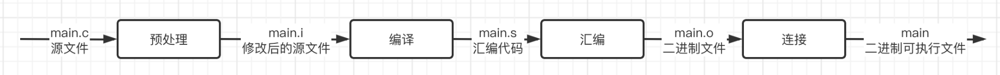

## 程序编译和调试

如何不借助IDE，通过最原始的方式手动完成程序的编译。

### C语言程序的编译

在开始之前，需要介绍一个编译器：

> GCC原名为GNU C语言编译器（GNU C Compiler），只能处理C语言。但其很快扩展，变得可处理C++，后来又扩展为能够支持更多编程语言，如Fortran、[Pascal](https://baike.baidu.com/item/Pascal/241171)、Objective -C、Java、Ada、Go以及各类处理器[架构](https://baike.baidu.com/item/架构/13004195)上的[汇编语言](https://baike.baidu.com/item/汇编语言/61826)等，所以改名GNU编译器套件（GNU Compiler Collection）

gcc编译器是将程序一步步编译为可执行文件:



1. 预处理（Pre-Processing）：首先会经过预处理器将程序中的预编译指令进行处理，然后把源文件中的注释这些没用的东西都给扬了。
2. 编译（Compiling）：处理好之后，就可以正式开始编译，首先会编译为汇编代码。
3. 汇编（Assembling）：接着就该将汇编代码编译为机器可以执行的二进制机器指令了，会得到一个二进制目标文件。
4. 链接（Linking）：最后需要将这个二进制目标文件与系统库和其他库的OBJ文件、库文件链接起来，最终生成了可以在特定平台运行的可执行文件。

比如在Windows操作系统下完成这四步，就会生成一个Windows的.exe可执行文件。

一步一步尝试一下，首先把CLion自带的GCC工具目录配置到环境变量中（Mac系统直接自带，不需要任何配置）：

位置在`CLion安装目录/bin/mingw/bin`，打开高级系统设置，添加环境变量：

配置完成后，打开CLion，随便编写一点内容：

```c
#include <stdio.h>

int main() {
    printf("Hello, World!\n");
    return 0;
}
```

然后点击IDE下方的终端面板：这里打开的是Windows自带的PowerShell终端，如果不是的可以在设置中修改：

现在就可以手动开始对C源文件进行编译了，首先是第一步，需要对源文件进行预处理：

```sh
gcc -E main.c -o main.i
```

其中 `-E` 后面的是源文件名称，`-o` 是预处理后生成的文件名称：

生成后，可以直接查看这个文件（因为此时依然是普通文本）代码在经过预处理之后，`#include <stdio.h>`中的内容都替换过来了

现在已经完成了预处理，接着就可以将其编译为汇编程序了：

```sh
gcc -S main.i -o main.s
```

这里的`-S`就是预处理之后的文件，可以直接将其编译为汇编代码：这里都是汇编代码，各种各样的汇编指令。

接着就可以将这个汇编代码继续编译为二进制文件了：

```sh
gcc -c main.s -o main.o
```

这里`-c`后的就是汇编程序，直接生成为二进制文件：

不过现在还没办法直接运行它，因为还需要进一步链接，变成Windows操作系统可以执行的程序：

```sh
gcc main.o -o main
```

这里直接将刚刚生成的目标文件编译为可执行文件，就可以直接运行了：

成功生成.exe文件，我们直接在控制台输入它的名字就可以运行了：

当然如果要更快速一点地完成编译，可以直接将源文件进行编译：

```sh
gcc main.c -o main
```

多文件的情况下:

```c
void swap(int * a, int * b);
```

```c
#include "test.h"

void swap(int * a, int * b) {
    int tmp = *a;
    *a = *b;
    *b = tmp;
}
```

```c
#include <stdio.h>
#include "test.h"

int main() {
    int arr[] = {4, 2, 1, 9, 5, 0, 3, 8, 7, 6};

    for (int i = 0; i < 9; ++i) {
        for (int j = 0; j < 9 - i; ++j) {
            if(arr[j] > arr[j + 1]) swap(&arr[j], &arr[j + 1]);
        }
    }

    for (int i = 0; i < 10; ++i) {
        printf("%d ", arr[i]);
    }
}
```

此时，还需要把引入的其他文件也给一起带上，所以：

```sh
gcc main.c test.c -o main
```

或是将两个文件单独编译为对应的二进制文件，最后再放到一起编译也是可以的：

```sh
gcc main.o test.o -o main
```

最后同样生成了一个可执行文件